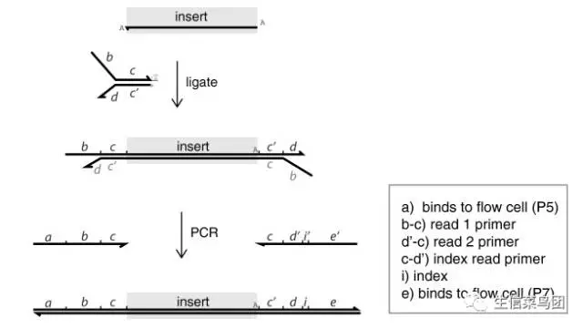

===============================
1.1 二代测序的barcode/index
===============================

定义
-----

barcode,也叫index,在二代测序中用于区分不同样品的。避免概念扩大，此处仅指在二代测序（NGS）里的barcode。

barcode是做什么的
------------------

普遍健壮的测序仪和通常瘦小的组数据
>>>>>>>>>>>>>>>>>>>>>>>>>>>>>>>>

当今二代测序仪器中应用最为广泛的当属illumina公司的测序仪，以Hiseq-2000测序仪为例，其有2个流动槽（flowcell），每个flowcell有8条lane（通道），而单就其一条lane的测序数据量就可达44G。
然而对于目前的外显子组测序来说，测序区域大约64M，测序深度200X，总数据量也才13G，Hiseq-2000的一个lane就足以测定3个外显子组样品。以转录组来说，一个样品测序量不会超过4G，一个lane可以同时测定10个转录组样品。
大体而言，外显子组测序、转录组测序、miRNA测序、lncRNA测序、ChIP测序等组数据，每个样品所需的数据量通常都比较少。

测序数据的单位
>>>>>>>>>>>>>>

核酸序列数据是以“A、T、G、C”碱基顺序表示，而其数量的大小可以使用k、M、G等单位来表示，k代表103、M代表106、G代表109，例如，人全基因组大小为3G（或3Gb），也就是3X109b。

此外，计算机的存储单位也是使用k、M、G等单位来表示的，不过计算机的存储单位的换算为1024进位，不同于碱基序列的1000进位。考虑到一个字母在计算机内存储为1Byte，因此粗略使用时，测序数据量可以近似等于其占用计算机的大小。

barcode是样品标签
>>>>>>>>>>>>>>>>>>

由于测序仪器的测序能力远大于测试样本序列量，为避免仪器浪费，因此一个lane同时测定多个样品成为很自然的思路。然而为了区分多种样品的序列，就必须要给不同样品加上特定的“标签”，从而可以在后续数据分析时将不同样品数据分开，而这个“标签”就是barcode。

简言之，barcode就是测序中混合样品的”身份证“，用于区分不同样品。

如何选择好的barcode
-------------------

barcode的选择有两个原则：碱基平衡和激光平衡。

碱基平衡
>>>>>>>>>

碱基平衡是指的需要兼顾barcode序列的平衡度与复杂度，平衡度是指的碱基的比例是均衡的（1:1是最均衡的），而复杂度是指的碱基的种类是多样的（四种碱基同时存在是最多样的）。

所以最好的barcode序列应该是同时有A、T、G、C四种碱基，且各碱基所占比例近似均为25%。

此处所说的碱基平衡是指的多个barcode之间的平衡，并非一个barcode内部的碱基平衡。举例来说，有12个转录组样品需要测定，那么就需要12个barcode（假定每个barcode长度为6位），根据碱基平衡原则，第一位barcode碱基应该尽量同时存在A、T、G、C四种碱基，且各碱基所占比例近似均为25%，也就是这12个barcode序列最佳情况应该是以A、T、G、C开头各3个。剩余5个碱基位的barcode以此类推。

激光平衡
>>>>>>>>>>

在illumina测序仪中，A和C两种碱基共用一种激光，由波长660nm的红激光激发；G和T共用一种激光，由波长532 nm的绿激光激发。因此假使不能满足碱基平衡的情况下，可以退而求其次，尽量满足激光平衡。

简单来说，激光平衡就是尽量在使用的一组barcode中满足每个碱基位都是A+C=G+T。

既不满足碱基平衡，又不满足激光平衡的barcode将会有很大的数据分离隐患，或者无法分离开样品，或者无法识别某些测序片段。

barcode组合举例
--------------------

illumina barcode 组合
>>>>>>>>>>>>>>>>>>>>>>>>>>>

Illumina推荐的12个barcode序列详列如下。

- ATCACG

- CGATGT

- TTAGGC

- TGACCA

- ACAGTG

GCCAAT

CAGATC

ACTTGA

GATCAG

TAGCTT

GGCTAC

CTTGTA

以其中的第一个位置为例（纵列），A:T:G:C=3:3:3:3=1:1:1:1。实际上，该barcode组合每个位置的碱基比例都接近1:1（具体见下表），碱基平衡度接近完美。

位置	1st	2nd	3rd	4th	5th	6th
A	3	3	4	3	3	3
T	3	3	3	3	4	3
C	3	3	3	3	2	3
G	3	3	2	3	3	3

样本数少于4种，必然无法满足碱基平衡，怎么办
>>>>>>>>>>>>>>>>>>>>>>>>>>>>>>>>>>>>>>>>>>>

如果样本数少于4种，则barcode每一个位置的碱基最多只有3种，不可能做到碱基平衡，怎么办呢？这时一定要尽量保证激光平衡，切不可在同一barcode位放置同一种荧光碱基，甚至是同一种碱基。

当然Illumina也提供了这种情况的解决方案，他们推荐的low-level pooling的barcode组合有3种，序列如下：

2重组合
>>>>>>>>

#6 GCCAAT

#12 CTTGTA

3重组合
>>>>>>>>

#4 TGACCA

#6 GCCAAT

#12 CTTGTA

6重组合

#2 CGATGT

#4 TGACCA

#5 ACAGTG

#6 GCCAAT

#7 CAGATC

#12 CTTGTA

这3种barcode组合包含有一个共同的内核：6号barcode和12号barcode。6号和12号组合是百分百激光平衡的，其每一个位置（纵列，即GC、CT、CT、AG、AT和TA）都分别属于不同的激光。也就是说，只要barcode组合中包含6号和12号，就能满足最基本的de-multiplexing要求，不至于数据完全失误。

除了illumina推荐的12个barcode，还有康奈尔大学的96个针对ApekⅠ酶建库的barcode，华中农业大学的96个针对MseⅠ酶和SacⅠ酶的barcode，美国科罗拉多大学博尔德分校的丹尼尔还发表了设计barcode的软件。

建库测序时barcode是如何发挥作用的
---------------------------------

这里以illumina测序仪为例。如图所示，在最下面的构建完好的可上级测序的序列中，insert是样品片段，barcode（图中的“i"）位于下游接头中。"a”与“e"是接头序列，用于结合到测序仪的flowcell上的P5和P7序列。

|image1|

若要构建完整的单barcode测序DNA簇，需要如下步骤：

超声，将DNA片段打碎，然后T4酶修补末端， klenow酶在3'末尾加A。

DNA连接酶将测序引物b-c以及d-c’与测序片段（末端加T）连接，其中”d"包含barcode序列“i”。

将文库片段上机，进行桥式PCR扩增，完成最终测序DNA簇构建。

图中，c与c'互补，d与d'互补，i与i'互补。

在illumina实际测序时，读完Read 1（在图中是以a-b-c方向延伸的序列）之后，如果需要继续读取barcode序列，那么就将Read 1变性洗走，然后加入barcode引物（也就是c-d'），继续第二轮读取，一般读取6-8个碱基，这6-8个碱基就包含了barcode序列。

参考文档
---------

公众号： 生信菜鸟团 https://mp.weixin.qq.com/s/KOKvuxAFVTKt2Cq2rdgl0A

