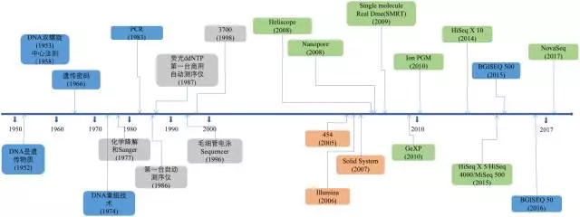

================
第二章 测序技术
================

前言
-------

首先，全基因组测序的英文是Whole Genome Sequencing，简称WGS，目前默认指的是人类的全基因组测序。所谓全（Whole），指的就是把物种细胞里面中完整的基因组序列从第1个DNA开始一直到最后一个DNA，完完整整地检测出来，并排列好，因此这个技术几乎能够鉴定出基因组上任何类型的突变。对于人类来说，全基因组测序的价值是极大的，它包含了所有基因和生命特征之间的内在关联性，当然也意味着更大的数据解读和更高的技术挑战。但，没关系，在这个系列中，我将从测序技术、数据产出、常用文件解析，数据质控和流程构建等各个方面结合实际的例子，详细阐述什么是全基因组测序以及该如何构造流程分析全基因组测序（WGS）数据

第一节 NGS测序技术
--------------------

在真正开始数据分析之前先知道我们是如何将那些原本存在于细胞中的DNA信息获取出来的——也就是测序的原理，总是有益的。

测序，简单来说就是将DNA化学信号转变为计算机可处理的数字信号。 

它从1977年的第一代Sanger技术发展至今，已经足有40年时间。在这个技术发展的更迭历程中，测序读长从长到短，再从短到长。虽然就当前形势看第二代短读长测序技术在全球范围内上占有着绝对的垄断位置，但第三测序技术也已在这几年快速地发展着。测序技术的每一次变革和突破，都对基因组学研究，疾病医疗研究，药物研发，育种等领域产生巨大的推动作用。所以在这个系列的第一篇里我将对当前最主流的测序技术以及它们的测序原理做一个全面的介绍。

|image1|

图1. 测序技术发展历程

第一代测序技术
>>>>>>>>>>>>>>

第一代DNA测序技术用的是1975年由桑格（Sanger）和考尔森（Coulson）开创的链终止法或者是1976-1977年由马克西姆（Maxam）和吉尔伯特（Gilbert）发明的化学法（链降解）. 并在1977年，由桑格老人家测定了第一个基因组序列——噬菌体phiX-174，全长只有5,375个碱基。虽然与今日的技术比起来根本不算什么，但自此之后，人类获得了窥探生命本质的能力，并以此为开端真正步入了基因组学时代。

研究人员在Sanger法的多年实践之中不断对其进行改进。在2001年，完成的首个人类基因组图谱就是以改进了的Sanger法为基础进行测序的。Sanger法的核心原理是：由于ddNTP（4种带有荧光标记的A,C,G,T碱基）的2’和3’都不含羟基，其在DNA的合成过程中不能形成磷酸二酯键，因此可以用来中断DNA的合成反应，在4个DNA合成反应体系中分别加入一定比例带有放射性同位素标记的ddNTP（分别为：ddATP,ddCTP,ddGTP和ddTTP），然后利用凝胶电泳和放射自显影后可以根据电泳带的位置确定待测分子的DNA序列（图2）。这个网站为Sanger测序法制作了一个小短片，形象而生动。

值得注意的是，在测序技术起步发展的这一时期中，除了Sanger法之外还出现了一些其他的测序技术，如焦磷酸测序法、连接酶法等。其中，焦磷酸测序法是后来Roche公司454技术所使用的测序方法，而连接酶测序法是后来ABI公司SOLID使用的测序方法，但他们的核心手段都是利用了Sanger中可中断DNA合成反应的dNTP。

|image2|

图2. Sanger测序发原理（来源：huangshujia博客园）

第二代测序技术
>>>>>>>>>>>>>>>

总的来说，第一代测序技术的主要特点是测序读长可达1,000bp，准确性高达99.999%，但其测序成本高，通量低等方面的缺点，严重影响了其真正大规模的应用。因而第一代测序技术并不是理想的测序方法。经过不断的技术开发和改进，以Roche公司的454技术、illumina公司的Solexa/Hiseq技术和ABI公司的SOLID技术为标记的第二代测序技术诞生了。第二代测序技术在大幅提高了测序速度的同时，还大大地降低了测序成本，并且保持了高准确性，以前完成一个人类基因组的测序需要3年时间，而使用二代测序技术则仅仅需要1周，但其序列读长方面比起第一代测序技术则要短很多，大多只有100bp-150bp。图3. 是第一代和第二代测序技术测序成本作了一个简单的比较，可以看出自第二代测序技术发展出来之后，历史开始发生根本性的改变，测序的成本开始快速实现断崖式下降，也就是业内经常提到的超摩尔定律现象。

|image3|

图3. 测序成本比较（来源：NIH官网）

接下来我以illumina（目前最大、最成功的NGS测序仪公司）的技术为基础简要单介绍第二代测序测序技术的原理和特点。 

目前illumina的测序仪占全球75%以上，以Hisq系列为主。它的机器采用的都是边合成边测序的方法，主要分为以下4个步骤：

|image4|

图4. illumina测序原理（来源：illumina官网）

1）构建DNA测序文库，图4-1
 :::::::::

|image4-1|

简单来说就是把一堆乱糟糟的DNA分子用超声波打断成一定长度范围的小片段。目前除了一些特殊的需求之外，基本都是打断为300bp-800bp长的序列片段，并在这些小片段的两端添加上不同的接头，构建出单链DNA文库，以备测序之用；

2）测序流动槽（flowcell），图4-2
 :::::::::

|image4-2|

flowcell是用于吸附流动DNA片段的槽道，也是核心的测序反应容器——所有的测序过程就发生在这里。当文库建好后，这些文库中的DNA在通过flowcell的时候会随机附着在flowcell表面的槽道（称为lane）上。每个flowcell有8个lane（图5），每个lane的表面都附有很多接头，这些接头能和建库过程中加在DNA片段两端的接头相互配对，这就是为什么flowcell能吸附建库后的DNA的原因，并能支持DNA在其表面进行桥式PCR的扩增，理论上这些lane之间是不会相互影响的。

|image5|

图5. flowcell（实物 VS 示意图）

3）桥式PCR扩增与变性
 :::::::::

|image6|

图6. 桥式PCR扩增（来源：illumina官网）

这是NGS技术的一个核心特点。桥式PCR以flowcell表面所固定的序列为模板，进行桥形扩增，如图6所示。经过不断的扩增和变性循环，最终每个DNA片段都将在各自的位置上集中成束，每一个束都含有单个DNA模板的很多分拷贝，这一过程的目的在于实现将单一碱基的信号强度进行放大，以达到测序所需的信号要求。 

4）测序，如图4-4和图7所示
 :::::::::

|image7|

图7. 边合成边测序（来源：illumina官网）

测序方法采用边合成边测序的方法。向反应体系中同时添加DNA聚合酶、接头引物和带有碱基特异荧光标记的4中dNTP（如同Sanger测序法）。这些dNTP的3’-OH被化学方法所保护，因而每次只能添加一个dNTP，这就确保了在测序过程中，一次只会被添加一个碱基。同时在dNTP被添加到合成链上后，所有未使用的游离dNTP和DNA聚合酶会被洗脱掉。接着，再加入激发荧光所需的缓冲液，用激光激发荧光信号（图7），并有光学设备完成荧光信号的记录，最后利用计算机分析将光学信号转化为测序碱基。这样荧光信号记录完成后，再加入化学试剂淬灭荧光信号并去除dNTP 3’-OH保护基团，以便能进行下一轮的测序反应。

Illumina的这种每次只添加一个dNTP的技术特点能够很好的地解决同聚物长度的准确测量问题，它的主要测序错误来源是碱基的替换，目前它的测序错误率在1%-1.5%左右。测序周期以人类基因组重测序为例，30x-50x测序深度对于Hisq系列需要3-5天时间，而对于2017年初最新推出的NovaSeq系列则只需要40个小时！

表1. 测序量比较（双流动槽为例，如为单流动槽则测序量减少为下表的一半，时间不变）

*一次测序的数据总产量的单位Gb，不是计算机字节，而是测序碱基的数目（Giga base）*

|image8|

图8. NovaSeq与其他测序仪测序通量的比较（来源：illumina官网）

上面表1和图8是NovaSeq和其他测序系列的比较，数据相当好。按照这个数据量估算，一台NovaSeq 6000（S4）在跑满的情况下，一年可以测序6400多人。而且按照以往的经验，illumina的官方公布的数据都是偏于保守的，我们在实际的使用过程中发现高质量（Q30）的read其实占到了总数据的90%以上，远高于官方公布的75%，数据的总产量也同样更高。

第三代测序技术
>>>>>>>>>>>>>>>>

这是一个新的里程碑。以PacBio公司的SMRT和Oxford Nanopore Technologies的纳米孔单分子测序技术为标志，被称之为第三代测序技术。与前两代相比，最大的特点就是单分子测序，测序过程无需进行PCR扩增，超长读长，以下图9是PacBio SMRT技术的测序读长分布情况，平均达到10Kb-15Kb，是二代测序技术的100倍以上，值得注意的是在测序过程中这些序列的读长也不再是相等的，下文有解析！

|image9|

图9.  PacBio SMRT 测序read读长分布

PacBio SMRT

PacBio SMRT技术其实也应用了边合成边测序的思想，并以SMRT芯片为测序载体（如同flowcell）。基本原理是： DNA聚合酶和模板结合，用4色荧光标记A,C,G,T这4种碱基（即是dNTP）。在碱基的配对阶段，不同的碱基加入，会发出不同的光，根据光的波长与峰值可判断进入的碱基类型。

|image10|

图9. PacBio SMRT 测序原理

这个DNA聚合酶是实现超长读长的关键之一，读长主要跟酶的活性保持有关，它主要受激光对其造成的损伤所影响。PacBio SMRT技术的一个关键点是在于如何将反应信号与周围游离碱基的强大荧光背景区别出来。他们利用的是ZMW（零模波导孔）原理：如同微波炉壁上可看到的很多密集小孔。这些小孔的直径是有严格要求的，如果直径大于微波波长，能量就会在衍射效应的作用下穿透面板从而泄露出来（光波的衍射效应），从而与周围小孔相互干扰（光波的干涉）。如果孔径能够小于波长，那么能量就不会辐射到周围，而是保持直线状态，从而可起到保护的作用。同理，在一个反应管(SMRTCell:单分子实时反应孔)中有许多这样的圆形纳米小孔,，即 ZMW(零模波导孔)，外径100多纳米，比检测激光波长小(数百纳米)，激光从底部打上去后不会穿透小孔进入上方的溶液区，能量会被限制在一个小范围(体积20X 10-21 L)里（图10-A），正好足够覆盖需要检测的部分，使得信号仅仅只是来自于这个小反应区域，孔外过多的游离核苷酸单体依然留在黑暗中，从而实现将背景噪音降到最低的目的。

PacBio SMRT技术除了能够检测普通的碱基之外，还可以通过检测相邻两个碱基之间的测序时间，来检测碱基的表观修饰情况，如甲基化。因为假设某个碱基存在表观修饰，则通过聚合酶时的速度会减慢，那么相邻两峰之间的距离会增大，我们可以通过这个时间上的差异来检测表观甲基化修饰等信息（图11）。

|image11|

图11. PacBio SMRT 检测甲基化修饰

SMRT技术的测序速度很快，每秒约10个dNTP。但这么快的测序速度也带来了一些明显的缺点——测序错误率比较高（这几乎是目前单分子测序技术的通病），可以达到10%-15%，而且以缺失序列和错位居多，但好在它的出错是随机的，并不会像第二代测序技术那样存在一定的碱基偏向，因此可以通过多次测序来进行有效纠错。

Oxford Nanopore

Oxford Nanopore 的MinION是另一个比较受关注的第三代测序仪，俗称U盘测序仪，它真的很小，我亲手拿过，并拆过，图12（左）！这家公司开发的纳米单分子测序技术与以往的测序技术相比都不一样，它是基于电信号而不是光信号的测序技术！

|image12|

图12. Oxford Nanopore MinION

这个技术的关键点在于他们所设计的一种特殊纳米孔，孔内共价结合分子接头。当DNA分子通过纳米孔时，它们使电荷发生变化，从而短暂地影响流过纳米孔的电流强度（每种碱基所影响的电流变化幅度是不同的），最后高灵敏度的电子设备检测到这些变化从而鉴定所通过的碱基（图13）。

|image13|

图13. MinION 测序原理

纳米孔测序以及其他第三代测序技术，有可能会彻底地解决目前第二代测序平台的诸多不足。另外，MinION的主要特点是：读长很长，而且比PacBio的都长得多，基本都是在几十kb上百kb以上，最新的数据显示可以达到900 kb！错误率是5%-15%，也是随机错误，MinION最大的特点除了极小的体积之外，就是数据将是可实时读取的，并且起始DNA在测序过程中不被破坏！这真是个可以上天的能力。然鹅，遗憾地多说几句，目前还没真正公布，细节也不知，自从2012开过一次发布会之后，就没什么声响了。

这种纳米孔单分子测序仪还有另一大特点，它能够直接读取出甲基化的胞嘧啶，而不必像二代测序方法那样需要事先对基因组进行bisulfite处理。这对于在基因组水平直接研究表观遗传相关现象有极大的帮助。下面是对PacBio和Oxford Nanopore这两家第三代测序技术公司的测序仪做的一个简单比较，可以看出其实成本还是蛮高的，质量也只是还行，期待他们的下一次进化吧。

总结
----------

以上，对各代测序技术的原理做了简要的阐述。在这个比较的过程中，可以看到测序成本，读长和通量是该测序技术先进与否的三个重要指标。其实第一代和第二代测序技术除了通量和成本上的差异之外，测序的核心原理都来自于边合成边测序的思想。第二代测序技术的优点是通量大大提升，成本大大减低，使得昔日王榭堂前燕，可以飞入寻常百姓家。总之，只有变成白菜价，才能真正对大众有意义；但它的缺点是所引入PCR过程会在一定程度上增加测序的错误率，并且具有系统偏向性，同时读长也比较短。第三代测序技术是为了解决第二代所存在的缺点而开发的，它的根本特点是单分子测序，不需要任何PCR的过程，这是为了能有效避免因PCR偏向性而导致的系统错误，同时提高读长，但这个技术还不是很成熟，需要再进化，成本也偏高。

|image14|

图14. 全球测序仪数量分布

参考
--------
公众号：碱基矿工https://mp.weixin.qq.com/s/tWHWA-f1RnP_XWY66p12pg

